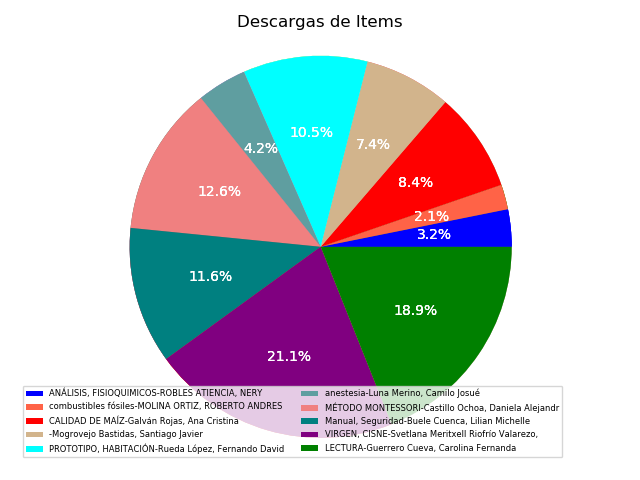

# edspace-server
- ejecutar docker-compose up -d en la raiz del proyecto.
- ingresar al container web con el siguiente comando  `docker exec -i -t edspace-web  /bin/bash`
- escribir el siguiente comando una vez ingresado el container `python manage.py shell`
- una vez ingresado a la consola poner el siguiente código:
```
   from core import views
   views.process_items_solr()
````
- finalmente en la raiz del proyecto se descarga una imagen llamada `pie_chart_items.png`

